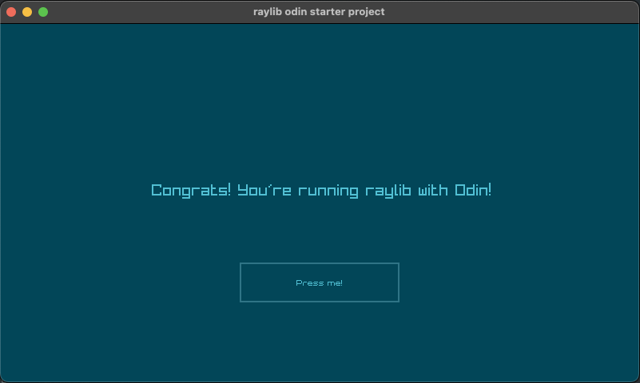

# Raylib Starter Odin

A super simple raylib/odin boiler plate project



## Helper Scripts

`./b` to build
`./r` to run

## Change Styles

To change styles, edit line 15 in `main.odin`

```odin
main :: proc () {
    rl.InitWindow(800, 450, "raylib odin starter project")
    rl.SetTargetFPS(60)
    rl.SetWindowState(rl.ConfigFlags{.WINDOW_RESIZABLE})
    
    // Load GUI Style (you can load your own GUI styles here)
    rl.GuiLoadStyle("styles/cyber/style_cyber.rgs");
```

For the love of programming!